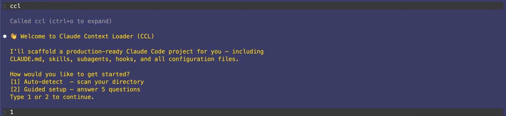
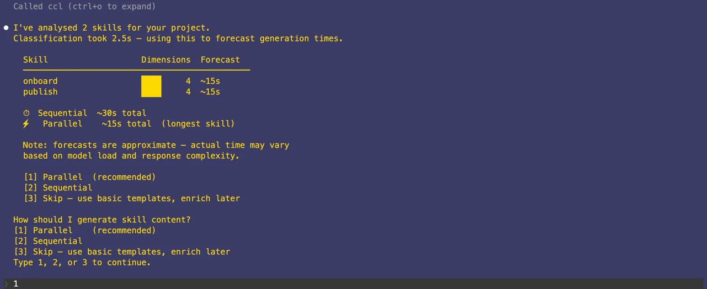
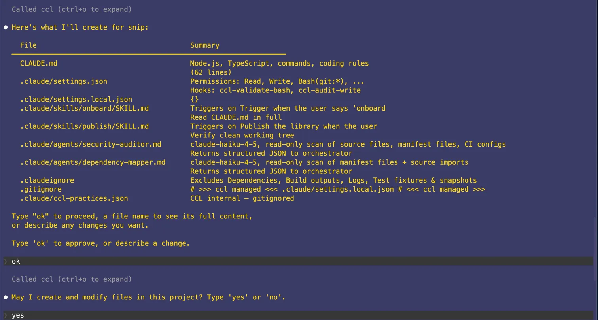
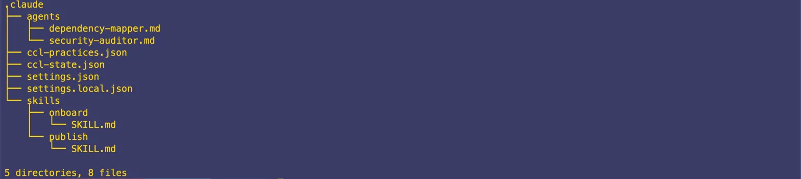
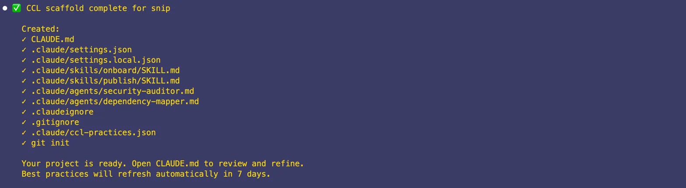

# CCL — Claude Context Loader

> Scaffold a production-ready Claude Code project in one command. No config files to write. No best practices to research. No setup tax.

---

🌐 [Website](https://your-org.github.ioccl)

---

## What is CCL?

CCL is an MCP server that plugs directly into Claude Code. Run it once with `npx ccl`, then type `ccl` in any project — CCL scans your codebase, builds a tailored scaffold plan, shows you every file it will create before writing anything, and then executes in one shot.

**What you get:**
- A `CLAUDE.md` written as a staff-engineer onboarding doc (≤200 lines, always)
- Skills tuned for your stack, with precise auto-activation triggers
- Subagents pre-configured with the right model and read-only tool scopes
- `settings.json` with security hooks on Bash and Write
- `.claudeignore` that keeps noise out of Claude's context
- `ccl-practices.json` that self-updates weekly with the latest Claude Code best practices

---

## Screenshots

<!--
  SCREENSHOT 1 — ccl greeting screen
  Show: The opening prompt in Claude Code with the two options:
  [1] Auto-detect and [2] Guided setup. Dark terminal background.
-->


<!--
  SCREENSHOT 2 — Auto-detect scan output
  Show: CCL printing what it detected (project name, stack, inferred commands)
  before presenting the scaffold plan.
-->


<!--
  SCREENSHOT 3 — Full plan presentation
  Show: The detailed plan output with exact CLAUDE.md content visible,
  followed by a skills section. Demonstrates the "no surprises" principle.
-->


<!--
  SCREENSHOT 4 — Scaffolded project tree
  Show: A terminal `tree .claude/` output after scaffold completes —
  skills/, agents/, settings.json, ccl-practices.json all present.
-->


<!--
  SCREENSHOT 5 — Best practices refresh
  Show: The weekly refresh prompt listing "+ 2 new practices found,
  - 1 outdated practice to remove, 14 unchanged".
-->


---

## Quick Start

**Requirements:** Node.js 18+ · Claude Code · API key storage uses the OS keychain (macOS Keychain, Windows Credential Vault, libsecret on Linux). On Linux, install libsecret-1-dev before running npx ccl.

```bash
# 1. Register CCL as an MCP server (one time only)
npx ccl

# 2. Open Claude Code in your project
cd your-project
claude

# 3. Type this
ccl
```

CCL will guide you from there. No flags. No config. No docs to read first.

---

## API Key (optional)

CCL scaffolds everything without an API key — CLAUDE.md, skills,
agents, and settings all work with static templates.

An Anthropic API key unlocks:
- AI-enriched CLAUDE.md content drawn from your project documentation
- AI-generated skill content tailored to your stack
- Interactive plan changes ("make the deploy skill more cautious")

Get a key at console.anthropic.com, then:

```bash
npx ccl --set-key sk-ant-...   # store key in OS keychain
npx ccl --list-key             # confirm which key is active
npx ccl --remove-key           # remove it later
```

`--list-key` prints a masked key (`sk-ant-...xK9f`) and its storage
location. If `ANTHROPIC_API_KEY` is set as an environment variable,
`--list-key` surfaces that too. If both are set, it warns that the
env var takes precedence.

Only one key is supported at a time. The key is stored exclusively
in your OS keychain (macOS Keychain, Windows Credential Vault,
libsecret on Linux) — it never lands in `claude.json` or any
other on-disk file. Restart Claude Code after any key change.

---

## How It Works

### How you respond

CCL outputs plain text and reads your next response as input — no dialog boxes, no timeouts. Type your answer in the Claude Code prompt and call ccl again.

### Two ways to start

**Auto-detect** — CCL reads your `package.json`, `pyproject.toml`, `go.mod`, `Cargo.toml`, `Dockerfile`, and CI config. It also recursively scans your project for markdown documentation (ARCHITECTURE.md, CONTRIBUTING.md, and any other .md files) to enrich stack detection and project type inference. It infers your stack, dev/test/build/lint commands, and project type, then builds a complete plan automatically.

**Guided setup** — Five focused questions, answered one at a time. CCL fills in everything else with intelligent defaults.

### The plan is everything

Before writing a single file, CCL shows you the exact content of every file it will create — `CLAUDE.md` line by line, each `SKILL.md`, each agent definition, `settings.json`, `.claudeignore`. You can request changes in plain English. CCL revises and re-presents. Nothing is written until you say so.

### One permission prompt

CCL asks for file-write permission once per session. Grant it once — no further prompts until the next session.

---

## What Gets Created

```
your-project/
├── CLAUDE.md                        ← Onboarding doc for your stack (≤200 lines)
├── .claudeignore                    ← Noise exclusions (node_modules, dist, logs…)
└── .claude/
    ├── settings.json                ← Permissions, hooks, tool allowlist
    ├── settings.local.json          ← Machine-local overrides (gitignored)
    ├── ccl-practices.json           ← Living best practices, self-updating weekly
    ├── ccl-state.json               ← Scaffold state for safe resume
    ├── skills/
    │   └── [skill-name]/
    │       └── SKILL.md             ← One per detected workflow
    └── agents/
        └── [agent-name].md          ← One per inferred task scope
```

---

## CLAUDE.md: The 200-Line Rule

CCL enforces a hard 200-line limit on `CLAUDE.md`. Every line must earn its place — the file loads fully into context at the start of every Claude Code session.

The structure CCL generates answers exactly seven questions:

| # | Section | What it covers |
|---|---|---|
| 1 | What is this? | One paragraph — senior engineer, 30 minutes to productive |
| 2 | Stack | Technologies, versions, key libraries |
| 3 | Where things live | Directory map, one line per folder |
| 4 | How to run it | Exact bash commands only — no prose |
| 5 | Coding rules | Project-specific constraints and conventions |
| 6 | Common pitfalls | What NOT to do and why |
| 7 | Never do | Absolute prohibitions with reasons |

---

## Skills and Agents

### Skills

Skills live in `.claude/skills/<name>/SKILL.md`. They are lazy-loaded — full content loads only when Claude determines relevance.

CCL writes each skill's `description` field as a precise trigger sentence. This is the most critical field: vague descriptions produce ~20% auto-activation; precise ones produce ~90%.

```yaml
---
name: deploy
description: >
  When the user asks to deploy, ship, release, or push to any environment —
  load this skill before running any deployment commands.
allowed-tools: [Read, Bash]
---
```

### Subagents

Agents are configured for the right model at the right scope:

| Task type | Model | Tools |
|---|---|---|
| Bulk reads, security scans, dependency mapping | `claude-haiku-4-5` | Read, Grep, Glob |
| Daily implementation, multi-file edits, tests | `claude-sonnet-4-6` | Full |
| Complex architecture, heavy algorithms | `claude-opus-4-7` | Full |

All subagents are read-only by default. They return structured JSON summaries to the orchestrator.

---

## Security Hooks

`settings.json` ships with two hooks enabled:

```json
"hooks": {
  "PreToolUse": [
    { "matcher": "Bash", "hooks": [{ "type": "command", "command": "ccl-validate-bash" }] }
  ],
  "PostToolUse": [
    { "matcher": "Write", "hooks": [{ "type": "command", "command": "ccl-audit-write" }] }
  ]
}
```

`ccl-validate-bash` runs before every shell command. `ccl-audit-write` logs every file write. These are the minimum viable security posture for agentic coding — CCL registers them in `settings.json` by default, not as an option. The hook commands must be available on your PATH; CCL writes the configuration but does not install the binaries.

Dangerous commands are blocked at the permission level:

```json
"deny": ["Bash(rm -rf:*)", "Bash(curl:*)", "Bash(wget:*)"]
```

See [SECURITY.md](SECURITY.md) for the full trust boundary model.

### Secret protection

CCL stores your Anthropic API key exclusively in the OS keychain (macOS Keychain, Windows Credential Vault, libsecret on Linux) — never in `claude.json`. Set it once with:

```bash
npx ccl --set-key sk-ant-...
npx ccl --remove-key        # to remove it later
```

All elicitation responses are scrubbed for high-entropy strings and known secret patterns before they are written to the MCP audit log.

---

## Best Practices: Self-Updating

CCL ships with 30 curated best practices drawn from Anthropic's Claude Code documentation and the broader Claude Code community. They cover `CLAUDE.md` structure, model routing, subagent patterns, skill activation, four-phase workflow, context window management, and more.

Every seven days, on the next `ccl` invocation, CCL offers to refresh:

```
📦 It's been 7 days since your best practices were last checked.

Would you like me to search for updates?

  [Accept]  — Refresh now (~30 seconds)
  [Later]   — Remind me next time
  [Never]   — Don't ask again
```

CCL performs a web search, diffs against the current `ccl-practices.json`, and presents exactly what changed before writing anything. You can accept, reject, or review each change individually.

---

## Interrupted Scaffolds

If a scaffold is interrupted, CCL detects it on the next `ccl` and offers to continue:

```
⚠️  It looks like a previous scaffold was interrupted.

Last completed step: skills/deploy
Remaining: agents/security-auditor, settings.json

[1] Continue from where I left off
[2] Start again from scratch
Type 1 or 2 to continue.
```

All writes are atomic and idempotent — resuming re-executes the full plan, and already-written files are overwritten with identical content.

---

## Re-scaffolding an Existing Project

If CCL finds `.claude/` or `CLAUDE.md` already present:

```
⚠️  I found an existing CCL scaffold in this directory.

  CLAUDE.md             ✓ exists
  .claude/              ✓ exists
  ccl-practices.json    ✓ exists (v1.2, last updated 3 days ago)

[1] Re-scaffold — Start fresh. All existing CCL files will be overwritten.
[2] Skip — Leave everything as-is and exit.
Type 1 or 2 to continue.
```

---

## Git Integration

CCL will run `git init` if no `.git` is present, then add the following to `.gitignore`:

```
.claude/settings.local.json
# ccl-state.json          ← added only if you chose not to sync it
```

CCL does nothing beyond this — no `git add`, no commits, no push.

`settings.json` is always committed to git (team-wide permissions). `settings.local.json` is always gitignored (machine-local overrides).

---

## Repo Structure

```
ccl/
├── packages/
│   ├── core/                   ← Shared logic
│   │   └── src/
│   │       ├── scaffold.ts     ← Plan builder + file writer + state manager
│   │       ├── practices.ts    ← ccl-practices.json manager + refresh logic
│   │       ├── detector.ts     ← Project file scanner + stack inferencer
│   │       └── templates/      ← All file templates
│   └── mcp/                    ← MCP server
│       └── src/
│           ├── index.ts        ← MCP server entry point
│           ├── setup.ts        ← npx ccl registration logic
│           └── commands/
│               └── ccl.ts      ← ccl command handler
├── CONTRIBUTING.md
├── LICENSE                     ← MIT
└── README.md
```

---

## CI / Quality Gates

Every pull request runs the following gates in order:

| Gate | Tool | Blocks on |
|---|---|---|
| Secret scanning | gitleaks | Any committed secret in full history |
| Shell injection | semgrep | exec/shell:true patterns in packages/ |
| Dependency audit | npm audit | Any CVE at moderate severity or above |
| Typecheck | tsc --strict | Any type error |
| Tests | tsx --test | Any failing assertion (currently 185) |

Run them locally:

```bash
npm ci
npm run typecheck
cd packages/core && npx tsx --test test/*.test.ts
cd packages/mcp  && npx tsx --test test/*.test.ts
```

---

## Contributing

See [CONTRIBUTING.md](CONTRIBUTING.md). The build sequence is documented in the blueprint — build `core/templates` first, then `detector`, `scaffold`, `practices`, and finally the MCP layer.

The lock file (`package-lock.json`) is committed to the repo — always run `npm ci` rather than `npm install` to reproduce the exact dependency tree.

---

## License

MIT © CCL contributors

---

> 🤖 Built using Claude. Runs in Claude. Makes Claude more powerful.